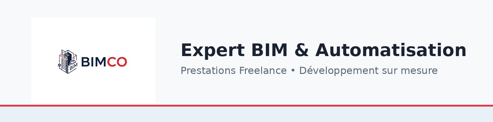
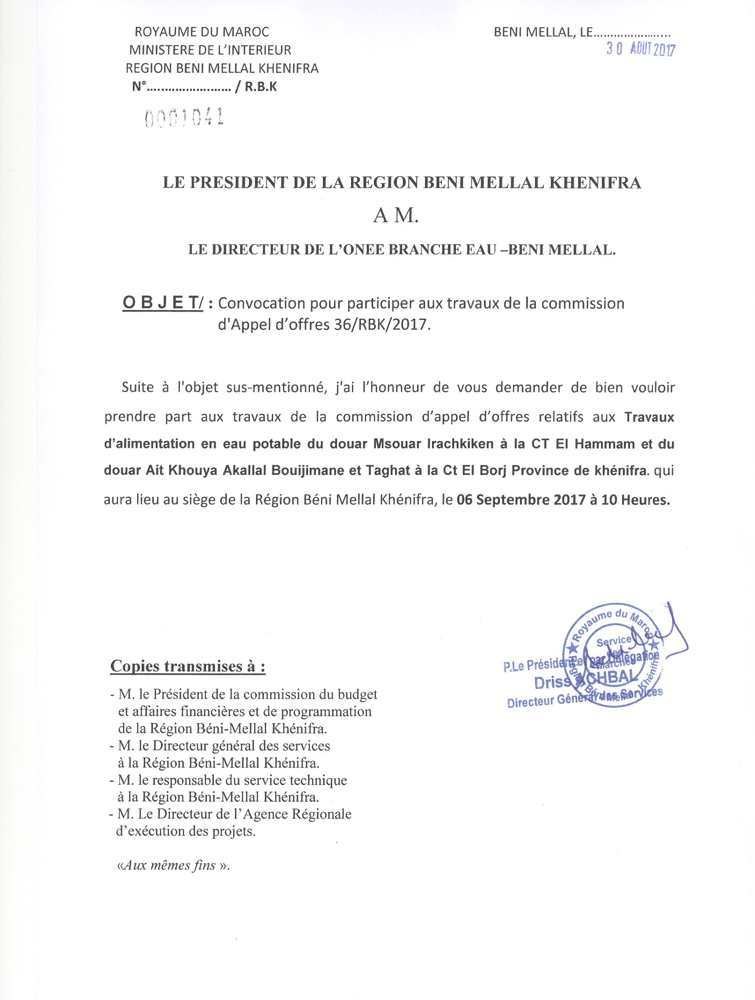
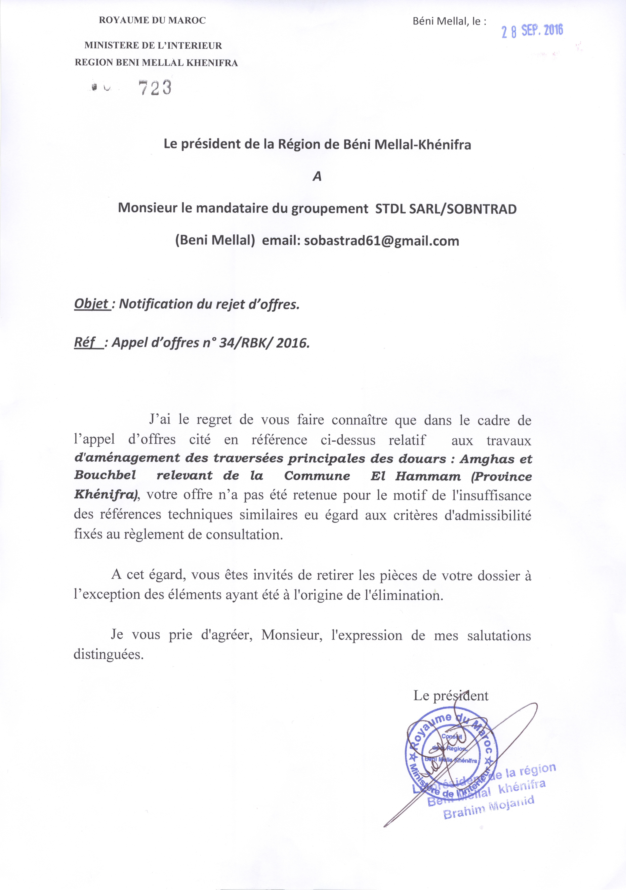
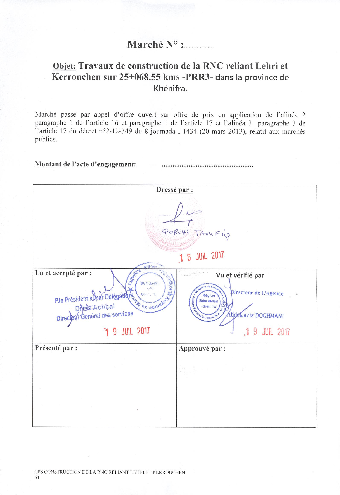

# RAPPORT U62 - COMPTE RENDU D'ACTIVITÉS PROFESSIONNELLES

---

## BTS MANAGEMENT ÉCONOMIQUE DE LA CONSTRUCTION

## Session 2026

---

**Candidat :** BAHAFID Mohamed

**N° Candidat :** 02537399911

**Académie :** Lyon

**Structure d'accueil :** Conseil Régional de Béni Mellal-Khénifra (Maroc)

**Direction :** Agence d'Exécution des Projets

**Poste :** Technicien Études et Suivi des Travaux

**Durée d'expérience :** 8 ans dans le BTP (3 ans Maroc + 5 ans France)

**Formation complémentaire :** BIM Modeleur Bâtiment (8 mois)

**Activité actuelle :** BIMCO – Projeteur BIM / Économiste de la construction (Micro-entreprise)

**SIREN :** 999580053 | **Code APE :** 7112B – Ingénierie, études techniques

**Siège :** 44 rue de la République, 42510 Bussières

---

*Compte rendu d'activités professionnelles*

---
---

## SOMMAIRE

1. **INTRODUCTION** .......................................... p. X

2. **PARTIE 1 : CADRE PROFESSIONNEL** .................. p. X
   - 1.1 Mon parcours professionnel
   - 1.2 Le Conseil Régional de Béni Mellal-Khénifra
   - 1.3 BIMCO – Mon activité indépendante

3. **PARTIE 2 : ACTIVITÉS ET PROJETS RÉALISÉS** ....... p. X
   - 2.1 Projet 1 : Travaux de mise à niveau des centres des communes (Marché n°38-RBK-2017)
   - 2.2 Projet 2 : Construction de la RNC Lehri-Kerrouchen (Marché n°46-RBK-2017)
   - 2.3 Activités complémentaires

4. **PARTIE 3 : ANALYSE ET COMPÉTENCES** .............. p. X
   - 3.1 Compétences acquises au regard du BTS MEC
   - 3.2 Analyse comparative Maroc / France
   - 3.3 Projet professionnel

5. **CONCLUSION** .......................................... p. X

6. **ANNEXES** ............................................. p. X

---
---

## INTRODUCTION

Fort de huit années d'expérience dans le secteur du bâtiment et des travaux publics, j'ai souhaité valider et structurer mes compétences en préparant le BTS Management Économique de la Construction en candidat libre.

Mon parcours professionnel m'a conduit du Maroc, où j'ai exercé pendant trois ans en tant que technicien études et suivi des travaux au sein du Conseil Régional de Béni Mellal-Khénifra, à la France, où j'ai occupé le poste de chef de chantier gros œuvre pendant cinq ans dans une entreprise spécialisée en maçonnerie. J'ai ensuite complété ce parcours par une formation de BIM Modeleur Bâtiment de huit mois, me dotant des compétences numériques indispensables à l'exercice moderne de l'économie de la construction. Aujourd'hui, je me suis orienté vers l'économie de la construction en tant qu'indépendant, activité qui capitalise sur l'ensemble de mon expérience terrain, bureau d'études et maîtrise du BIM.

Cette double expérience, à la fois côté maîtrise d'ouvrage publique au Maroc et côté exécution en France, m'a offert une vision complète du cycle de vie d'un projet de construction : de la programmation et la consultation des entreprises jusqu'à la réception des ouvrages, en passant par le suivi technique et financier des chantiers.

Le présent rapport rend compte des activités les plus significatives de mon expérience professionnelle. Il s'articule autour de deux projets majeurs réalisés au sein du Conseil Régional de Béni Mellal-Khénifra :

- **Projet 1 :** Les travaux de mise à niveau des centres de quatre communes de la province de Khénifra, un marché d'aménagement urbain d'un montant de 53,5 millions de dirhams TTC (environ 4,8 millions d'euros), couvrant huit corps d'état distincts.

- **Projet 2 :** La construction de la route nationale communale reliant Lehri et Kerrouchen sur 25 kilomètres, un marché de 29 millions de dirhams TTC (environ 2,6 millions d'euros).

Ces deux projets illustrent la diversité des missions que j'ai pu assurer : métrés, études de prix, analyse des offres, suivi financier et suivi de chantier. Ils permettent également de mettre en lumière les spécificités de la maîtrise d'ouvrage publique et des marchés publics marocains.

Après une présentation de mon cadre professionnel, je détaillerai les activités réalisées sur chacun de ces projets, avant de proposer une analyse des compétences acquises et de mon projet professionnel.

---
---

## PARTIE 1 : CADRE PROFESSIONNEL

### 1.1 Mon parcours professionnel

Mon parcours dans le secteur du BTP s'étend sur plus de dix années, depuis ma première formation au Maroc jusqu'à la création de mon entreprise en France. Il se décompose en cinq phases distinctes :

**Phase 1 : Formation et premières expériences – Maroc (2014-2017)**

Ma formation initiale au Maroc m'a doté des bases techniques solides du BTP :

- **2014-2016 :** Formation de Technicien Chef de Chantier BTP – apprentissage de la planification des travaux, de l'organisation des équipes, des métrés et des estimations.
- **2016-2017 :** Diplôme de Technicien spécialisé en Gros Œuvre à l'**ISBTP** (Institut Spécialisé du BTP, Maroc) – expertise dans le suivi des travaux et la gestion des aspects techniques de chantier.

**Phase 2 : Chargé d'affaires / Suivi de travaux – Conseil Régional, Maroc (août 2017 – janvier 2022)**

À l'issue de ma formation, j'ai intégré le Conseil Régional de Béni Mellal-Khénifra en tant que chargé d'affaires, suivi de travaux, au sein de l'Agence d'Exécution des Projets. Pendant **quatre ans et demi**, mes missions principales portaient sur :

- Le pilotage de projets publics de construction
- La rédaction des pièces techniques des marchés publics et appels d'offres
- L'établissement des avant-métrés et des estimations de l'administration
- La coordination des entreprises et le suivi des chantiers en phase exécution
- Le contrôle de conformité des travaux avec les marchés et réglementations
- Le suivi administratif : ordres de service, décomptes, PV de réception
- La participation aux commissions d'appel d'offres

Au cours de cette période, j'ai participé au suivi de sept marchés publics de travaux, représentant un volume global de plus de 100 millions de dirhams d'investissement dans les infrastructures de la province de Khénifra : routes, pistes rurales, adduction d'eau potable, aménagement urbain et construction de bâtiments.

**Phase 3 : Chef d'équipe et chef de chantier gros œuvre – France (2022-2024)**

Après mon installation en France, j'ai exercé sur chantier dans deux entreprises :

- **Septembre 2022 – Avril 2023 :** Chef d'équipe gros œuvre chez **Ergalis, Feurs** (Loire) – lecture de plans, implantation et traçage, montage des banches, mise en place des armatures, coulage du béton et suivi des cycles de coffrage.
- **Janvier 2024 – Juillet 2024 :** Chef de chantier BTP chez **Minssieux et Fils, Mornant** (Rhône) – encadrement opérationnel d'une équipe sur chantier de construction, organisation quotidienne des tâches, suivi de l'avancement des travaux et contrôle qualité d'exécution.

Cette expérience terrain m'a permis de comprendre les coûts réels de production (main-d'œuvre, matériaux, matériel), d'appréhender les contraintes d'exécution qui impactent directement les prix, et de maîtriser les techniques de gros œuvre : coffrage, rotation de banches, ferraillage, bétonnage. Cette immersion dans la réalité du chantier m'a donné une connaissance concrète des coûts et des rendements, atout majeur pour un futur économiste de la construction.

**Phase 4 : Formation Technicien Modeleur BIM – AFPA Colmar (2023-2024)**

Souhaitant enrichir mon profil et m'adapter aux évolutions numériques du secteur, j'ai suivi la formation de **Technicien Modeleur BIM** à l'**AFPA de Colmar** (8 mois). Cette formation m'a permis d'acquérir les compétences suivantes :

- La modélisation 3D de bâtiments sur **Revit** (Architecture et Structure)
- La compréhension du processus **BIM** (Building Information Modeling) et de ses niveaux de maturité
- L'extraction de quantités à partir de maquettes numériques (métrés automatiques)
- La coordination et la synthèse de maquettes numériques avec **Navisworks**
- Le développement de scripts **Dynamo** pour automatiser les workflows
- Le développement de plugins Revit en **C#** via l'**API Revit**
- L'utilisation de **Python** pour l'automatisation de tâches BTP
- Les formats d'échange **IFC** et l'interopérabilité entre logiciels

Cette formation constitue un atout stratégique pour l'économie de la construction, car le BIM transforme profondément les pratiques de métrés et d'études de prix. L'extraction automatique des quantités depuis une maquette numérique améliore la précision des métrés et réduit considérablement les risques d'erreurs par rapport aux méthodes traditionnelles sur plan 2D.

**Phase 5 : Création de BIMCO – Indépendant (depuis janvier 2026)**

Fort de cette quadruple expérience – études de marchés publics, terrain d'exécution, maîtrise du BIM et développement d'outils –, j'ai créé le 9 janvier 2026 ma micro-entreprise **BIMCO** (SIREN 999580053, code APE 7112B – Ingénierie, études techniques). Mon positionnement allie projeteur BIM et économiste de la construction, avec pour objectif de proposer des prestations de modélisation 3D, métrés (extraction BIM et méthode traditionnelle), études de prix, études de méthodes, phasage gros œuvre et développement d'outils et scripts pour la construction.

Le BTS Management Économique de la Construction constitue pour moi la validation officielle de ce parcours et le tremplin vers le développement de mon activité.

---

### 1.2 Le Conseil Régional de Béni Mellal-Khénifra

#### Présentation de la collectivité

Le Conseil Régional de Béni Mellal-Khénifra est une collectivité territoriale marocaine créée dans le cadre du découpage régional de 2015. La région couvre cinq provinces : Béni Mellal, Azilal, Fquih Ben Salah, Khénifra et Khouribga. Elle s'étend sur une superficie d'environ 28 374 km² et compte une population de plus de 2,5 millions d'habitants.

En tant que collectivité territoriale, le Conseil Régional dispose de compétences propres en matière de développement régional, notamment :

- La construction et l'entretien des routes régionales et communales
- L'aménagement des centres urbains et ruraux
- Les projets d'adduction d'eau potable en milieu rural
- La construction d'équipements publics (écoles, dispensaires, centres communaux)

Le budget d'investissement du Conseil Régional consacré aux travaux d'infrastructure représente plusieurs centaines de millions de dirhams annuels, répartis sur l'ensemble du territoire.

#### Organisation interne

Le Conseil Régional est dirigé par un Président élu. L'administration est organisée autour de plusieurs directions, dont l'Agence d'Exécution des Projets, service dans lequel j'ai exercé mes fonctions.

L'Agence d'Exécution des Projets, dirigée par Monsieur Abdelaaziz DOGHMANI, est responsable de la maîtrise d'ouvrage des projets d'infrastructure. Elle assure :

- La programmation des projets d'investissement
- La préparation des dossiers d'appel d'offres
- Le lancement et le suivi des procédures de marchés publics
- Le suivi technique et financier des marchés en cours d'exécution
- La réception des ouvrages

Mon poste de technicien études et suivi des travaux s'inscrivait au sein de cette agence, sous l'autorité directe du Directeur. Je travaillais en collaboration avec les conducteurs d'opération, les techniciens de suivi et le service des marchés.

**Organigramme de l'Agence d'Exécution des Projets (reconstitué) :**

```
┌─────────────────────────────────────────────┐
│       PRÉSIDENT DU CONSEIL RÉGIONAL         │
│       Béni Mellal-Khénifra                  │
└────────────────────┬────────────────────────┘
                     │
┌────────────────────▼────────────────────────┐
│   DIRECTEUR DE L'AGENCE D'EXÉCUTION        │
│       DES PROJETS                           │
│   M. Abdelaaziz DOGHMANI                   │
└────────────────────┬────────────────────────┘
                     │
       ┌─────────────┼──────────────┐
       │             │              │
┌──────▼──────┐ ┌───▼────────┐ ┌───▼──────────┐
│  Service    │ │  Service   │ │  Service     │
│  Études &   │ │  Marchés & │ │  Suivi des   │
│  Programmation│ │ Contrats │ │  Travaux     │
└──────┬──────┘ └───┬────────┘ └───┬──────────┘
       │            │              │
  ┌────▼────┐  ┌────▼────┐   ┌────▼──────────┐
  │Techniciens│ │Gestionnaires│ │Conducteurs   │
  │d'études  │ │de marchés│  │d'opération   │
  └─────────┘  └─────────┘   └──────┬────────┘
                                     │
                              ┌──────▼────────┐
                              │ Techniciens   │
                              │ de suivi      │
                              │ (dont mon     │
                              │  poste)       │
                              └───────────────┘
```

*Figure 1 – Organigramme simplifié de l'Agence d'Exécution des Projets (reconstitué de mémoire)*

#### Le cadre réglementaire des marchés publics marocains

L'ensemble des marchés de travaux du Conseil Régional est régi par le Décret n° 2-12-349 du 20 mars 2013 relatif aux marchés publics. Ce décret fixe les règles de passation, d'exécution et de contrôle des marchés publics au Maroc.

Les principales procédures utilisées sont :

- **L'appel d'offres ouvert :** procédure principale, ouverte à tout candidat remplissant les conditions
- **L'appel d'offres restreint :** réservé aux candidats pré-sélectionnés
- **Le marché négocié :** dans des cas exceptionnels prévus par le décret

Les pièces constitutives d'un dossier d'appel d'offres comprennent :

- Le Cahier des Prescriptions Spéciales (CPS)
- Le Règlement de Consultation (RC)
- Le Bordereau des Prix – Détail Estimatif (BPDE)
- Les plans et pièces dessinées
- L'estimation confidentielle de l'administration

Ce cadre réglementaire rigoureux a structuré l'ensemble de mes activités au sein du Conseil Régional.

---

### 1.3 BIMCO – Mon activité indépendante



Aujourd'hui installé en France, j'ai créé le **9 janvier 2026** ma micro-entreprise **BIMCO**, immatriculée sous le SIREN 999580053, avec le code APE **7112B** (Ingénierie, études techniques à titre indépendant). Le siège est établi au 44 rue de la République, 42510 Bussières (Loire).

Le nom **BIMCO** reflète le positionnement de mon activité à la croisée du **BIM** (Building Information Modeling) et de l'économie de la **CO**nstruction.

**Fiche d'identité de l'entreprise :**

| Élément | Détail |
|---------|--------|
| **Dénomination** | BIMCO |
| **Forme juridique** | Entrepreneur individuel – Micro-entreprise |
| **SIREN** | 999580053 |
| **SIRET** | 99958005300018 |
| **Code APE** | 7112B – Ingénierie, études techniques |
| **Date de création** | 09/01/2026 |
| **Catégorie** | Activités spécialisées, scientifiques et techniques |
| **Siège** | 44 rue de la République, 42510 Bussières |

**Domaines d'intervention :**

- Projeteur BIM et dessinateur technique
- Modélisation 3D et coordination de maquettes numériques
- Métrés et quantitatifs tous corps d'état (extraction BIM et méthode traditionnelle)
- Études de prix et estimations
- Études de méthodes construction bâtiment
- Phasage et planification de chantier
- Développement d'outils et scripts pour la construction
- Vérification de devis et de situations de travaux
- Suivi économique de projets

**Outils et méthodes de travail :**

- **Revit** (Architecture et Structure) pour la modélisation BIM et l'extraction de quantités
- **Navisworks** pour la coordination de maquettes et la détection de clashs
- **Dynamo** pour la création de scripts visuels automatisant les workflows Revit
- **Python** et **C# / API Revit** pour le développement de plugins et l'automatisation
- Microsoft Excel avancé (tableaux de suivi, bases de prix, formules de calcul)
- AutoCAD pour la lecture et l'exploitation des plans
- **MS Project** pour la planification et le suivi d'avancement
- Maîtrise du processus BIM et des formats d'échange IFC
- Connaissance des bases de données de prix (bordereaux de référence)

**Réalisation phare : Application « Gestion Chantiers » par BIMCO**

Dans le cadre de mon activité, j'ai conçu et développé une application complète de gestion d'entreprise BTP, accessible en version web (gestion.bimco-consulting.fr) et en application desktop Windows. Cette réalisation concrète illustre ma capacité à développer des outils numériques pour le secteur de la construction.

**Fonctionnalités principales :**

| Module | Description |
|--------|-------------|
| **Devis** | Création de devis structurés, bibliothèque d'ouvrages, import/export Excel, conversion automatique en chantier |
| **Chantiers** | Suivi multi-projets (vue cartes, liste, Kanban), gestion par phases, budget détaillé (12 postes), géolocalisation |
| **Facturation** | Factures classiques et situations de travaux (avancement), relances automatiques en 3 niveaux, OCR pour import factures |
| **Équipes** | Planning hebdomadaire, affectations, suivi des compétences, taux d'occupation |
| **Main d'œuvre** | Pointage, planification, variables de paie |
| **Finances** | Analyse de rentabilité (30+ indicateurs), suivi des coûts, tableaux de bord en temps réel |
| **Documents** | GED, gestion documentaire, modèles, fiches d'intervention avec photo et signature |
| **Approvisionnements** | Gestion fournisseurs, catalogue matériaux, commandes, stocks |

**Stack technique :** React/TypeScript, Node.js/Express, PostgreSQL, Electron, Docker – déployé sur serveur NAS via Docker.

Cette application démontre ma capacité à traduire les besoins métier du BTP en outils numériques fonctionnels, compétence directement liée à l'objet social de BIMCO (« développement d'outils et scripts pour la construction »).

[À FOURNIR PAR LE CANDIDAT : Captures d'écran de l'application Gestion Chantiers – tableau de bord, page devis, suivi chantier – depuis gestion.bimco-consulting.fr]

**Atouts de mon profil :**

La combinaison de mon expérience côté maîtrise d'ouvrage (Maroc), côté exécution (France), ma formation BIM et ma capacité à développer des outils numériques me confère une compréhension globale de la chaîne de valeur d'un projet de construction. Je maîtrise aussi bien l'aspect théorique des études de prix que la réalité des coûts de production sur chantier, tout en créant les outils numériques qui optimisent ces processus.

---
---

## PARTIE 2 : ACTIVITÉS ET PROJETS RÉALISÉS

### 2.1 Projet 1 : Travaux de mise à niveau des centres des communes – Marché n°38-RBK-2017

#### 2.1.1 Présentation du projet

**Fiche d'identité du projet :**

| Élément | Détail |
|---------|--------|
| **Objet** | Travaux de mise à niveau des centres des communes de la province de Khénifra |
| **N° de marché** | 38-RBK-2017 (Lot 4) |
| **Maître d'ouvrage** | Conseil Régional de Béni Mellal-Khénifra |
| **Localisation** | Province de Khénifra – 4 communes |
| **Montant HT** | 44 605 581 DH (~4 050 000 €) |
| **TVA (20%)** | 8 921 116 DH |
| **Montant TTC** | 53 526 697 DH (~4 860 000 €) |
| **Nature** | Aménagement urbain – VRD – Infrastructures |
| **Allotissement** | Lot unique, 4 communes |

Ce projet d'envergure avait pour objectif la mise à niveau des centres de quatre communes rurales de la province de Khénifra :

1. **Commune d'El Hammam** – Montant HT : 6 634 919 DH
2. **Commune de Kerrouchen** – Montant HT : 7 336 914 DH
3. **Commune d'Ouaoumana** – Montant HT : 15 830 359 DH
4. **Commune de Sebt Ait Rahou** – Montant HT : 14 803 389 DH

Les travaux portaient sur huit parties techniques distinctes, couvrant l'ensemble des corps d'état nécessaires à l'aménagement d'un centre urbain :

| N° Partie | Désignation | Exemple de travaux |
|-----------|-------------|-------------------|
| Partie 1 | Assainissement et réseaux divers | Tranchées, buses PEHD/PVC/BA, regards, bouches d'égout |
| Partie 2 | Travaux de chaussée | Terrassement, couche de fondation GNF, couche de base GNA, enrobés |
| Partie 3 | Aménagement des trottoirs | Bordures T1/T3, revêtement béton, carreaux striés, pavés |
| Partie 4 | Signalisation | Marquage au sol, panneaux, peinture bordures |
| Partie 5 | Éclairage public | Tranchées, tubes annelés, massifs candélabres, câbles |
| Partie 6 | Murs et divers ouvrages | Béton armé, maçonnerie moellons, gabions |
| Partie 7 | Aménagement paysager | Terre végétale, réseau d'arrosage, plantation arbres |
| Partie 8 | Mobilier urbain | Corbeilles, bancs en granite |

[À FOURNIR PAR LE CANDIDAT : Carte de localisation des 4 communes (El Hammam, Kerrouchen, Ouaoumana, Sebt Ait Rahou) – capture Google Maps de la province de Khénifra]

#### 2.1.2 Mes missions sur ce projet

**a) Établissement de l'estimation de l'administration**

Ma première mission sur ce projet a été de participer à l'établissement de l'estimation confidentielle de l'administration. Cette estimation, obligatoire avant tout lancement d'appel d'offres, consiste à évaluer le coût prévisionnel des travaux sur la base des quantités métrées et des prix unitaires de référence.

Pour chaque commune, j'ai procédé au métré détaillé des ouvrages projetés :

- **Assainissement :** calcul des linéaires de tranchées, des volumes de déblais et remblais, des longueurs de canalisations par diamètre (315, 400, 500, 800 et 1000 mm), du nombre de regards et bouches d'égout
- **Chaussée :** calcul des cubatures de terrassement, des volumes de couche de fondation (GNF1) et de couche de base (GNA 0/31,5), des tonnages d'enrobés bitumineux
- **Trottoirs :** métrés des surfaces de revêtement, des linéaires de bordures par type (T1, T3, I2), des volumes de couche de base (GNB)
- **Éclairage public :** linéaires de tranchées et de tubes, nombre de massifs pour candélabres

Pour la commune d'Ouaoumana par exemple, les principaux métrés que j'ai établis sont :

| Ouvrage | Quantité | Unité |
|---------|----------|-------|
| Tranchées assainissement | 3 620 | m³ |
| Buses PEHD Ø400 | 1 160 | ml |
| Buses PEHD Ø500 | 1 210 | ml |
| Regards de visite | 56 | U |
| Terrassement chaussée | 4 200 | m³ |
| Couche de fondation GNF1 | 1 560 | m³ |
| Enrobés EB 0/10 | 2 175 | T |
| GBB 0/14 | 1 245 | T |
| Bordures T3 | 4 800 | ml |
| Bordures T1 | 5 890 | ml |
| Revêtement carreaux striés | 11 500 | m² |
| Massifs candélabres | 163 | U |

La méthode de métré employée s'appuyait sur les plans de projet fournis par le bureau d'études maître d'œuvre, complétés par des relevés sur site. Les quantités ont été calculées à l'aide de tableurs Excel structurés, avec des formules de calcul vérifiables.

**Extrait du Bordereau des Prix – Détail Estimatif (reconstitué) – Commune d'Ouaoumana :**

| N° Prix | Désignation des ouvrages | Unité | Quantité | P.U. HT (DH) | Montant HT (DH) |
|---------|-------------------------|-------|----------|---------------|------------------|
| **Partie 1 – Assainissement** | | | | | |
| 1.1 | Tranchées pour canalisations (y/c blindage et remblai) | m³ | 3 620 | 45,00 | 162 900 |
| 1.2 | Fourniture et pose de buses PEHD Ø400 | ml | 1 160 | 120,00 | 139 200 |
| 1.3 | Fourniture et pose de buses PEHD Ø500 | ml | 1 210 | 165,00 | 199 650 |
| 1.4 | Regards de visite (y/c cadre et tampon fonte) | U | 56 | 3 500,00 | 196 000 |
| **Partie 2 – Chaussée** | | | | | |
| 2.1 | Terrassement en pleine masse | m³ | 4 200 | 30,00 | 126 000 |
| 2.2 | Couche de fondation en GNF1 0/40 | m³ | 1 560 | 135,00 | 210 600 |
| 2.3 | Enrobés bitumineux EB 0/10 (y/c transport et mise en œuvre) | T | 2 175 | 450,00 | 978 750 |
| 2.4 | Grave bitume GBB 0/14 | T | 1 245 | 380,00 | 473 100 |
| **Partie 3 – Trottoirs** | | | | | |
| 3.1 | Bordures T3 préfabriquées (y/c fondation) | ml | 4 800 | 85,00 | 408 000 |
| 3.2 | Bordures T1 préfabriquées (y/c fondation) | ml | 5 890 | 70,00 | 412 300 |
| 3.3 | Revêtement en carreaux de ciment striés | m² | 11 500 | 120,00 | 1 380 000 |

*Tableau reconstitué de mémoire – les prix unitaires sont indicatifs et correspondent aux ordres de grandeur des marchés publics marocains de 2017*

**b) Préparation du dossier de consultation des entreprises**

En tant que technicien études, j'ai participé à la constitution du dossier d'appel d'offres, qui comprenait :

- Le **Cahier des Prescriptions Spéciales (CPS)** : document contractuel définissant les clauses administratives et techniques du marché
- Le **Règlement de Consultation (RC)** : définissant les conditions de participation et les critères de jugement des offres
- Le **Bordereau des Prix – Détail Estimatif (BPDE)** : document à remplir par les soumissionnaires avec leurs prix unitaires et montants
- Les **plans et pièces graphiques** : plans d'aménagement, profils, coupes types

Ma contribution a porté principalement sur la vérification de la cohérence entre le CPS (description technique des travaux) et le BPDE (quantités et nomenclature des prix). J'ai également vérifié que chaque poste du bordereau correspondait bien à un ouvrage décrit dans le cahier des charges.



**c) Analyse des offres et Commission d'Appel d'Offres**

Après réception des offres, j'ai participé à l'analyse technique et financière des soumissions. Ce travail comprenait :

- La vérification arithmétique des offres de prix (montants unitaires × quantités)
- La détection des prix anormalement bas ou excessifs
- L'établissement du tableau comparatif des offres
- La vérification des pièces administratives des soumissionnaires
- La participation à la Commission d'Appel d'Offres (CAO) en tant que membre technique

La grille de notation utilisée combinait des critères techniques (valeur technique de l'offre, moyens humains et matériels, références) et le critère prix. L'offre économiquement la plus avantageuse était retenue conformément au décret n° 2-12-349.



**Extrait de la grille de notation des offres (reconstitué – données anonymisées) :**

| Critère | Pondération | Entreprise A | Entreprise B | Entreprise C |
|---------|-------------|-------------|-------------|-------------|
| **Offre financière** | 70 pts | 62/70 | 70/70 | 55/70 |
| **Moyens humains** | 10 pts | 8/10 | 7/10 | 9/10 |
| **Moyens matériels** | 10 pts | 9/10 | 8/10 | 7/10 |
| **Références similaires** | 10 pts | 8/10 | 9/10 | 6/10 |
| **TOTAL** | **100 pts** | **87/100** | **94/100** | **77/100** |
| **Classement** | | 2ème | **1er (retenu)** | 3ème |

*Note : L'offre financière est notée en fonction de l'écart avec l'estimation de l'administration. L'offre la plus proche reçoit la note maximale. Les données des entreprises sont anonymisées.*

*Tableau reconstitué de mémoire – les notes sont indicatives et illustrent la méthodologie de notation utilisée*

**d) Suivi financier du marché**

Pendant la phase d'exécution des travaux, j'ai assuré le suivi économique du marché :

- **Vérification des situations de travaux mensuelles :** contrôle des quantités déclarées par l'entreprise, rapprochement avec l'avancement réel constaté sur chantier
- **Suivi des décomptes provisoires :** vérification des montants calculés sur la base des prix unitaires du marché et des quantités réellement exécutées
- **Gestion des travaux supplémentaires :** identification des travaux non prévus au marché initial, établissement des avenants
- **Tableau de bord financier :** suivi de la consommation budgétaire par partie et par commune

Exemple de suivi financier pour la commune de Kerrouchen :

| Partie | Montant marché HT (DH) | % du total |
|--------|------------------------|------------|
| 1. Assainissement | 907 600 | 12,4% |
| 2. Chaussée | 2 494 500 | 34,0% |
| 3. Trottoirs | 1 409 300 | 19,2% |
| 4. Signalisation | 101 100 | 1,4% |
| 5. Éclairage public | 525 754 | 7,2% |
| 6. Murs et ouvrages | 612 000 | 8,3% |
| 7. Aménagement paysager | 1 046 660 | 14,3% |
| 8. Mobilier urbain | 240 000 | 3,3% |
| **TOTAL HT** | **7 336 914** | **100%** |

Ce suivi permettait d'alerter la hiérarchie en cas de dépassement budgétaire et de préparer les éléments nécessaires à la passation d'éventuels avenants.

#### 2.1.3 Aspects économiques du projet

Le marché n°38-RBK-2017 présentait des enjeux économiques importants du fait de son volume (plus de 53 millions de DH TTC) et de sa complexité (4 communes, 8 parties techniques).

**Répartition budgétaire par commune :**

| Commune | Montant HT (DH) | Montant TTC (DH) | % du total |
|---------|-----------------|-------------------|------------|
| El Hammam | 6 634 919 | 7 961 903 | 14,9% |
| Kerrouchen | 7 336 914 | 8 804 297 | 16,5% |
| Ouaoumana | 15 830 359 | 18 996 431 | 35,5% |
| Sebt Ait Rahou | 14 803 389 | 17 764 067 | 33,2% |
| **TOTAL** | **44 605 581** | **53 526 697** | **100%** |

On constate que les communes d'Ouaoumana et de Sebt Ait Rahou concentrent à elles seules plus de 68% du budget total, ce qui s'explique par l'étendue de leurs centres urbains et le volume de travaux associé.

**Analyse par partie technique (toutes communes confondues) :**

La partie "Aménagement des trottoirs" (Partie 3) représente le poste le plus lourd, suivi par les travaux de chaussée (Partie 2) et l'assainissement (Partie 1). L'éclairage public et la signalisation constituent les postes les moins importants en valeur.

Cette répartition est caractéristique des projets de mise à niveau de centres urbains au Maroc, où les aménagements de surface (trottoirs, revêtements) et les réseaux enterrés (assainissement) représentent la majorité de l'investissement.

**Enseignements économiques :**

- L'importance de la précision des métrés : une erreur de 5% sur les quantités de la Partie 3 (trottoirs) peut représenter un écart de plus de 1 million de DH
- La nécessité d'un suivi rigoureux par commune pour éviter les transferts de crédits non autorisés
- L'impact des conditions locales (nature du terrain, accessibilité) sur les prix réels d'exécution

#### 2.1.4 Difficultés rencontrées et solutions apportées

**Difficultés techniques :**

- La diversité des corps d'état (8 parties) nécessitait une coordination complexe entre les différents intervenants
- Les conditions géologiques variables d'une commune à l'autre rendaient les métrés de terrassement incertains (présence de terrain rocheux nécessitant des plus-values)
- La gestion simultanée de quatre chantiers géographiquement dispersés

**Difficultés économiques :**

- Les travaux supplémentaires liés aux découvertes de terrain non prévues dans les études initiales
- La gestion des écarts entre les quantités estimées et les quantités réellement exécutées
- Le respect de l'enveloppe budgétaire globale malgré les aléas

**Solutions mises en œuvre :**

- Mise en place d'un tableau de bord Excel consolidé permettant le suivi en temps réel par commune et par partie
- Visites de chantier régulières pour valider les quantités déclarées par l'entreprise
- Anticipation des avenants par une veille continue sur les écarts de quantités
- Communication régulière avec la hiérarchie sur l'état d'avancement financier

---

### 2.2 Projet 2 : Construction de la RNC Lehri-Kerrouchen – Marché n°46-RBK-2017

#### 2.2.1 Présentation du projet

**Fiche d'identité du projet :**

| Élément | Détail |
|---------|--------|
| **Objet** | Travaux de construction de la route nationale communale reliant Lehri et Kerrouchen |
| **N° de marché** | 46-RBK-2017 |
| **Maître d'ouvrage** | Conseil Régional de Béni Mellal-Khénifra |
| **Localisation** | Province de Khénifra |
| **Linéaire** | 25,069 km |
| **Montant HT** | 24 169 371 DH (~2 197 000 €) |
| **TVA (20%)** | 4 833 874 DH |
| **Montant TTC** | 29 003 246 DH (~2 636 000 €) |
| **Nature** | Construction de route – Infrastructure routière |
| **Programme** | PRR3 (Programme des Routes Rurales, 3ème tranche) |

Ce projet s'inscrivait dans le cadre du Programme National des Routes Rurales (PNRR), programme stratégique du Royaume du Maroc visant à désenclaver les zones rurales en construisant un réseau de routes communales revêtues. La route Lehri-Kerrouchen, d'une longueur de 25 kilomètres, traverse un relief montagneux dans la province de Khénifra.

Le projet se décomposait en trois sections :

- **Section linéaire principale** (23 prix) : corps de chaussée, ouvrages hydrauliques, ouvrages de soutènement
- **Carrefour au PK 0+000** (11 prix) : aménagement du point de raccordement
- **Bretelles d'accès** (19 prix) : voies de raccordement aux villages riverains

[À FOURNIR PAR LE CANDIDAT : Plan de situation de la route Lehri-Kerrouchen (25 km) – capture Google Maps ou plan topographique]

#### 2.2.2 Mes missions sur ce projet

**a) Établissement de l'estimation de l'administration**

Pour ce projet routier, l'estimation de l'administration a nécessité un travail de métré spécifique aux ouvrages routiers. Les principales quantités calculées étaient :

**Section linéaire – Principaux métrés :**

| N° | Ouvrage | Quantité | Unité | P.U. HT (DH) | Montant HT (DH) |
|----|---------|----------|-------|---------------|------------------|
| 1 | Déblais | 120 334 | m³ | 20,00 | 2 406 672 |
| 2 | Remblais | 76 735 | m³ | 25,00 | 1 918 385 |
| 7 | Couche de base GNB | 19 989 | m³ | 140,00 | 2 798 418 |
| 8 | Couche de fondation GNF2 | 34 481 | m³ | 130,00 | 4 482 466 |
| 11 | Buses Ø1000 (135A) | 794 | ml | 1 200,00 | 953 388 |
| 13 | Acier HA | 64,5 | T | 12 000,00 | 774 360 |
| 14 | Béton B2 | 733 | m³ | 1 000,00 | 732 740 |
| 15 | Béton B3 (y/c fossé bétonné) | 4 579 | m³ | 900,00 | 4 121 082 |
| 20 | Gabions | 789 | m³ | 350,00 | 276 010 |

Le calcul des cubatures de terrassement (déblais/remblais) a été réalisé à partir des profils en travers fournis par le bureau d'études routier. Les quantités d'ouvrages hydrauliques (buses, dalots) ont été déterminées en fonction de l'étude hydrologique et du nombre de talwegs traversés sur les 25 km du tracé.

Les quantités de corps de chaussée (couche de fondation GNF2 et couche de base GNB) ont été calculées sur la base du profil en travers type de la route, avec une largeur de plateforme adaptée au trafic prévisionnel.

**b) Vérification des pièces du DCE**

J'ai participé à la vérification de la cohérence du dossier de consultation :

- Vérification de la concordance entre le CPS et le BPDE (53 prix au total)
- Contrôle des quantités du bordereau par rapport aux plans de projet
- Vérification des prix unitaires de référence par rapport aux mercuriales en vigueur
- Relecture du Règlement de Consultation



**c) Suivi technique des travaux**

Pendant l'exécution, j'ai participé au suivi technique du chantier :

- Vérification de l'implantation du tracé routier
- Contrôle de la conformité des matériaux mis en œuvre (granulats, bitume, béton)
- Vérification des épaisseurs de couches de chaussée
- Suivi de l'avancement kilométrique
- Participation aux réunions de chantier

Les ordres de service émis au cours du marché illustrent la gestion opérationnelle du projet :

- **OS n°1 :** Ordre de commencer les travaux immédiatement (octobre 2017)
- **OS d'arrêt :** Arrêt des travaux pour cause d'intempéries et conditions climatiques défavorables
- **OS n°7 :** Reprise de l'exécution des travaux

Ces ordres de service, que j'ai contribué à préparer, témoignent des aléas inhérents à un chantier routier en zone montagneuse : interruptions hivernales, accès difficiles, conditions météorologiques contraignantes.

**d) Suivi financier**

Le suivi financier du marché routier portait sur :

- Les attachements contradictoires des quantités exécutées
- Les décomptes provisoires mensuels
- Le suivi des quantités de terrassement (poste le plus sensible aux écarts)
- La gestion de la révision des prix

**Répartition du budget par nature de travaux :**

| Poste | Montant HT (DH) | % |
|-------|-----------------|---|
| Terrassement (déblais + remblais) | 4 325 057 | 17,9% |
| Corps de chaussée (GNB + GNF2) | 7 280 884 | 30,1% |
| Revêtement (bicouche + imprégnation) | 2 588 570 | 10,7% |
| Ouvrages hydrauliques (buses + béton) | 6 793 920 | 28,1% |
| Ouvrages de soutènement (gabions, géotextile) | 458 220 | 1,9% |
| Bretelles et carrefour | 2 722 720 | 11,3% |
| **TOTAL HT** | **24 169 371** | **100%** |

Le corps de chaussée et les ouvrages hydrauliques représentent à eux seuls 58% du budget, ce qui est caractéristique d'un projet routier en zone de montagne où les ouvrages de traversée des cours d'eau sont nombreux.

#### 2.2.3 Difficultés rencontrées et solutions apportées

**Difficultés spécifiques au projet routier :**

- **Relief montagneux :** le tracé de 25 km traverse un terrain accidenté, générant des volumes importants de déblais (120 000 m³) et nécessitant des ouvrages de soutènement en gabions
- **Conditions climatiques :** les intempéries hivernales ont imposé des arrêts de chantier, comme en témoignent les ordres de service d'arrêt et de reprise
- **Écarts de quantités :** les cubatures de terrassement réelles se sont écartées des quantités prévisionnelles en raison de la géologie réelle rencontrée (terrain rocheux)
- **Ouvrages hydrauliques :** le nombre et le dimensionnement des ouvrages de traversée ont dû être ajustés en fonction des crues observées pendant les travaux

**Solutions apportées :**

- Suivi rapproché des quantités de terrassement par des attachements contradictoires réguliers
- Anticipation des périodes d'arrêt dans le planning d'exécution
- Ajustement des métrés d'ouvrages hydrauliques en concertation avec le bureau d'études
- Communication transparente avec l'entreprise sur la gestion des aléas

---

### 2.3 Activités complémentaires

#### 2.3.1 Autres marchés suivis au Conseil Régional

Outre les deux projets principaux détaillés ci-dessus, j'ai participé au suivi de cinq autres marchés de travaux au sein du Conseil Régional :

| N° Marché | Objet | Type |
|-----------|-------|------|
| 27-RBK-2017 | Construction route village Sidi Bouabbad à Oued Grou (CT Sidi Lamine) | Route / Piste rurale |
| 28-RBK-2017 | Route Ajdir-Ayoun Oum Errabia + Piste Lijon Kichchon (CT Sidi Lamine) | Route + Piste |
| 30-RBK-2017 | Adduction en Eau Potable El Borj – El Hamam | AEP |
| 39-RBK-2017 | Pistes Hartaf – Sebt Ait Rahou | Pistes rurales |
| 49-RBK-2016 | Aménagement voie Amghass – Bouchbel | Voirie |

Sur ces marchés, mes interventions comprenaient la vérification des implantations, la participation aux commissions d'ouverture des plis, le suivi des ordres de service et la vérification ponctuelle des situations de travaux.

Cette diversité de projets (routes, pistes, eau potable, aménagement urbain, voirie) m'a permis d'acquérir une vision élargie des différents types de marchés publics de travaux et de leurs spécificités techniques et économiques.

#### 2.3.2 Expérience de chef d'équipe et chef de chantier gros œuvre en France

Mon expérience terrain en France s'est déroulée au sein de deux entreprises :

**Chef d'équipe gros œuvre – Ergalis, Feurs (septembre 2022 – avril 2023)**

Chez Ergalis à Feurs (Loire), j'ai exercé en tant que chef d'équipe gros œuvre. Mes missions portaient sur la lecture de plans, l'implantation et le traçage, le montage des banches, la mise en place des armatures, le coulage du béton et le suivi des cycles de coffrage. Cette expérience m'a permis de maîtriser les techniques de gros œuvre de l'intérieur.

**Chef de chantier BTP – Minssieux et Fils, Mornant (janvier 2024 – juillet 2024)**

Chez Minssieux et Fils à Mornant (Rhône), j'ai assuré l'encadrement opérationnel d'une équipe sur chantier de construction : organisation quotidienne des tâches, gestion des priorités terrain, suivi de l'avancement des travaux et contrôle qualité d'exécution.

**Apports pour l'économie de la construction :**

- **Comprendre les coûts réels de production :** main-d'œuvre, rendements, consommation de matériaux, coûts de matériel. Cette connaissance est précieuse pour un économiste qui doit estimer des prix réalistes.
- **Maîtriser les études de méthodes :** phasage gros œuvre, rotation de banches, optimisation des cycles de coffrage. Ces compétences sont directement transposables à l'économie de la construction.
- **Appréhender les contraintes d'exécution :** accès chantier, intempéries, coordination entre corps d'état, approvisionnements. Ces contraintes impactent directement les coûts et les délais.
- **Maîtriser les techniques de gros œuvre :** coffrage, ferraillage, bétonnage, maçonnerie. La connaissance technique des ouvrages est indispensable pour réaliser des métrés précis.
- **Gérer les équipes et le planning :** organisation quotidienne du travail, anticipation des besoins, gestion des imprévus.

Cette expérience terrain me permet aujourd'hui, en tant qu'économiste et projeteur BIM, d'estimer les coûts avec une connaissance concrète des réalités d'exécution.

#### 2.3.3 Outils et logiciels utilisés

Au cours de mes différentes expériences, j'ai utilisé et maîtrisé les outils suivants :

| Outil | Utilisation | Niveau |
|-------|------------|--------|
| **Revit** (Architecture + Structure) | Modélisation BIM, extraction de quantités, plans depuis maquette | Autonome |
| **Navisworks** | Coordination de maquettes, détection de clashs, revue de projet | Autonome |
| **Dynamo** | Scripts visuels pour automatiser les workflows Revit | Autonome |
| **Python** | Automatisation de tâches BTP, traitement de données | Autonome |
| **C# / API Revit** | Développement de plugins Revit personnalisés | Autonome |
| **React / TypeScript / Node.js** | Développement d'application web de gestion BTP (Gestion Chantiers) | Autonome |
| **PostgreSQL / Docker** | Base de données et déploiement conteneurisé | Autonome |
| Microsoft Excel avancé | Métrés, estimations, tableaux de suivi financier, bases de données prix | Expert |
| AutoCAD | Lecture de plans, métrés sur plan, pièces dessinées | Autonome |
| **MS Project** | Planification, suivi d'avancement | Autonome |
| **CYPE** | Calculs et dimensionnement | Notions |
| **Formats IFC / BIM** | Échange de maquettes, interopérabilité entre logiciels | Autonome |
| Plateforme de dématérialisation des marchés publics | Publication et gestion des appels d'offres | Autonome |
| Microsoft Word | Rédaction CPS, RC, rapports, ordres de service | Expert |
| Microsoft PowerPoint | Présentations de projets | Autonome |

---
---

## PARTIE 3 : ANALYSE ET COMPÉTENCES

### 3.1 Compétences acquises au regard du BTS MEC

Le tableau ci-dessous synthétise les compétences développées au cours de mes huit années d'expérience, mises en regard avec les exigences du BTS Management Économique de la Construction :

| Compétence BTS MEC | Expérience Maroc (MOA) | Expérience France (terrain) | Indépendant | Niveau |
|--------------------|------------------------|---------------------------|-------------|--------|
| Réaliser des métrés | Avant-métrés, attachements, BPDE sur 7 marchés | Connaissance des quantités réelles sur chantier | Métrés sur plan pour clients | Autonome |
| Estimer un ouvrage | Estimations de l'administration, bordereaux de prix | Connaissance des coûts réels de production | Estimations et études de prix | Autonome |
| Analyser des offres | Tableaux comparatifs, grilles de notation, CAO | - | Veille sur les prix du marché | Autonome |
| Suivre un budget | Décomptes, situations, suivi financier de 7 marchés | Suivi des coûts chantier au quotidien | Tableaux de bord économiques | Autonome |
| Suivre un chantier | Réunions, vérification avancement, OS | 5 ans de gestion quotidienne de chantier | Visites conseil | Expert |
| Rédiger des pièces de marchés | CPS, RC, BPDE, OS, PV | - | - | Autonome |
| Planifier | Planning de travaux, phasage | Planning d'exécution quotidien | Planning d'études | Autonome |
| Utiliser des logiciels | Excel, AutoCAD, plateforme marchés | - | Logiciels de métrés, Excel avancé | Autonome |
| Modéliser en BIM | - | - | Revit Architecture/Structure, extraction quantités, IFC | Autonome |
| Connaître la réglementation | Décret marchés publics marocain | DTU, normes françaises | Code commande publique français | En progression |

**Compétence distinctive : la triple vision MOA / Exécution / BIM**

Peu de professionnels de l'économie de la construction disposent à la fois d'une expérience significative côté maîtrise d'ouvrage, côté exécution et d'une maîtrise des outils BIM. Cette triple compétence me permet de :

- Comprendre les attentes du maître d'ouvrage en matière de justification des prix
- Connaître les contraintes réelles d'exécution qui impactent les coûts
- Établir des estimations réalistes, ni trop basses (risque de marché infructueux) ni trop hautes (risque de surcoût pour la collectivité)
- Analyser les offres avec pertinence, en identifiant les prix anormalement bas ou élevés
- Exploiter les maquettes BIM pour extraire des quantités précises et fiables, réduisant les marges d'erreur dans les métrés

---

### 3.2 Analyse comparative Maroc / France

Mon parcours international me permet de comparer les pratiques de la construction et des marchés publics entre le Maroc et la France :

| Aspect | Maroc | France |
|--------|-------|--------|
| **Réglementation marchés** | Décret n° 2-12-349 du 20/03/2013 | Code de la commande publique |
| **Seuils de procédure** | Appel d'offres ouvert au-dessus de 500 000 DH | Appel d'offres au-dessus de seuils européens |
| **Pièces du marché** | CPS + RC + BPDE | CCAP + CCTP + BPU/DQE ou DPGF |
| **Estimation préalable** | Estimation confidentielle de l'administration obligatoire | Estimation du maître d'ouvrage |
| **Normes construction** | Normes marocaines, RPS 2000 (sismique) | DTU, Eurocodes, RE2020 |
| **Suivi financier** | Attachements contradictoires, décomptes | Situations de travaux mensuelles |
| **Révision des prix** | Formule de révision contractuelle | Actualisation et révision selon CCAP |
| **Contrôle** | Commission d'Appel d'Offres | Commission d'Appel d'Offres |

**Similitudes :** Les deux systèmes partagent les mêmes principes fondamentaux de la commande publique : transparence, égalité de traitement des candidats, mise en concurrence, et choix de l'offre économiquement la plus avantageuse.

**Différences :** Le système marocain est plus centralisé et le décret de 2013 régit l'ensemble des procédures, tandis que le système français est plus complexe avec le Code de la commande publique et ses nombreux textes d'application. La France dispose également d'un cadre normatif plus développé (DTU, Eurocodes) et d'exigences environnementales plus contraignantes (RE2020).

**Apport de cette double culture :** Cette expérience internationale m'a développé une capacité d'adaptation et une ouverture d'esprit qui constituent des atouts dans un secteur du BTP de plus en plus mondialisé.

---

### 3.3 Projet professionnel

Mon projet professionnel repose sur une conviction forte : **les outils numériques doivent être au service de l'économiste de la construction**, et non l'inverse. Mon ambition est de concevoir et développer des outils BIM spécialement pensés pour le management économique de la construction.

**À court terme : Obtenir le BTS MEC et structurer BIMCO**

Le BTS Management Économique de la Construction représente la validation officielle de mes compétences acquises sur le terrain. Il crédibilisera le positionnement de BIMCO et me permettra de lancer les premières prestations combinant économie de la construction et développement d'outils numériques.

Dès l'obtention du diplôme, je prévois de proposer :

- Des prestations classiques de métrés, études de prix et suivi financier
- Le développement de scripts et plugins Revit pour automatiser l'extraction de quantités depuis les maquettes BIM
- Des tableaux de bord de suivi économique de chantier, adaptés aux besoins des maîtres d'ouvrage et des économistes

L'application « Gestion Chantiers » que j'ai déjà développée (React/Node.js/PostgreSQL) constitue un premier prototype concret de cette démarche. Elle automatise la création de devis, le suivi des situations de travaux et la gestion financière des marchés — autant de tâches chronophages quand elles sont réalisées manuellement.

**À moyen terme : Développer une gamme d'outils BIM pour l'économie de la construction**

Mon objectif est de créer une gamme d'outils numériques qui répondent aux besoins réels des professionnels du MEC :

- **Plugins Revit d'extraction automatique de quantités** : à partir d'une maquette IFC ou Revit, générer directement des métrés structurés par lots et corps d'état, prêts à être valorisés
- **Outils de chiffrage assisté** : bases de données de prix unitaires actualisées, connectées aux maquettes BIM, permettant d'établir des estimations en temps réel
- **Applications web de suivi économique** : tableaux de bord interactifs pour le suivi des décomptes, la comparaison estimatif/réel, la gestion des avenants et des révisions de prix
- **Automatisation des documents marchés** : génération assistée de bordereaux de prix (DPGF/BPU), de CCTP économiques et de rapports d'analyse des offres

Ma double compétence — économiste de la construction formé au terrain ET développeur maîtrisant le BIM — constitue un avantage différenciant rare dans le secteur. Peu de professionnels combinent la connaissance métier approfondie (8 ans de BTP) et la capacité technique de coder des solutions sur mesure.

**À long terme : Positionner BIMCO comme un acteur de la transformation numérique du MEC**

Mon ambition est de faire évoluer BIMCO vers un cabinet d'ingénierie spécialisé, à l'intersection du BIM et de l'économie de la construction. BIMCO interviendrait sur deux axes complémentaires :

- **Prestations d'ingénierie** : métrés BIM, études de prix, AMO économique, analyse d'offres — sur des projets neufs, rénovation, marchés publics et privés
- **Édition d'outils numériques** : développement et commercialisation d'outils BIM dédiés aux économistes de la construction, comblant le manque actuel d'outils adaptés à ce métier

Ma double culture Maroc/France, mon expérience terrain (chef de chantier gros œuvre), mes compétences en études (technicien marchés publics) et ma maîtrise du BIM (formation 8 mois + développement web) constitueront les fondations de cette ambition.

---
---

## CONCLUSION

Ces huit années d'expérience dans le secteur du bâtiment et des travaux publics, entre le Maroc et la France, m'ont permis de construire un profil professionnel riche et complémentaire.

Au sein du Conseil Régional de Béni Mellal-Khénifra, j'ai acquis les fondamentaux de l'économie de la construction côté maîtrise d'ouvrage publique : métrés, estimations, analyse des offres, suivi financier. Les deux projets détaillés dans ce rapport – la mise à niveau des centres de quatre communes (53,5 millions DH) et la construction de la route Lehri-Kerrouchen (29 millions DH) – illustrent la diversité et la technicité des missions que j'ai pu assurer.

En France, mon expérience de chef de chantier gros œuvre m'a donné une connaissance irremplaçable des réalités du terrain : coûts de production, rendements, contraintes d'exécution. Cette immersion de cinq ans dans le quotidien du chantier constitue un atout que peu d'économistes de la construction possèdent. Ma formation de BIM Modeleur Bâtiment (8 mois) est venue compléter ce profil en m'ouvrant aux pratiques numériques qui transforment aujourd'hui l'économie de la construction : modélisation 3D sur Revit, extraction automatique de quantités et collaboration en maquette numérique.

Aujourd'hui, à travers ma micro-entreprise **BIMCO** créée en janvier 2026 (code APE 7112B – Ingénierie, études techniques), je réunis ces trois expertises – maîtrise d'ouvrage, exécution et BIM – au service d'une ambition claire : **créer des outils BIM dédiés au management économique de la construction**. L'application « Gestion Chantiers » que j'ai développée en est le premier prototype concret. Mon objectif est de concevoir des solutions numériques qui répondent aux besoins réels des économistes de la construction, en m'appuyant sur ma connaissance approfondie du métier et sur les technologies BIM les plus actuelles.

Le BTS Management Économique de la Construction représente pour moi bien plus qu'un diplôme : c'est la validation officielle d'un parcours professionnel engagé et le socle sur lequel je construirai des outils qui transformeront la pratique quotidienne de l'économie de la construction.

Je tiens à remercier l'ensemble des personnes qui m'ont accompagné dans ce parcours, et particulièrement les équipes de l'Agence d'Exécution des Projets du Conseil Régional de Béni Mellal-Khénifra pour la confiance qu'elles m'ont accordée.

---
---

## ANNEXES

**Liste des annexes :**

1. CV professionnel détaillé – Mohamed BAHAFID / BIMCO
2. Organigramme de l'Agence d'Exécution des Projets (reconstitué)
3. Extrait du Bordereau des Prix – Détail Estimatif du marché n°38-RBK-2017 (reconstitué)
4. Extrait du Bordereau des Prix – Détail Estimatif du marché n°46-RBK-2017
5. Tableau de suivi financier détaillé – Commune de Kerrouchen (reconstitué)
6. Extrait de la grille de notation des offres (reconstitué – données anonymisées)
7. Synthèse de création BIMCO – Guichet Unique des Entreprises (INPI) – Formalité J00205403397
8. Tableau comparatif réglementation marchés publics Maroc / France
9. Sélection de photos de chantier – Projets suivis au Conseil Régional

**Annexes complémentaires (à ajouter si disponibles) :**

- Attestation de travail – Conseil Régional de Béni Mellal-Khénifra
- Attestation de travail – Minssieux et Fils, Mornant
- Attestation de travail – Ergalis, Feurs
- Attestation de formation BIM Modeleur Bâtiment – AFPA Colmar
- Captures d'écran de l'application « Gestion Chantiers » par BIMCO

---

### Annexe 5 – Tableau de suivi financier détaillé – Commune de Kerrouchen (reconstitué)

**Marché n°38-RBK-2017 – Travaux de mise à niveau du centre de Kerrouchen**
**Montant du marché HT : 7 336 914 DH**

| N° | Partie | Montant marché HT (DH) | Montant exécuté HT (DH) | Taux d'exécution | Écart (DH) | Observations |
|----|--------|------------------------|--------------------------|-----------------|------------|-------------|
| 1 | Assainissement et réseaux divers | 907 600 | 885 420 | 97,6% | -22 180 | Linéaire réel légèrement inférieur |
| 2 | Travaux de chaussée | 2 494 500 | 2 618 225 | 104,9% | +123 725 | Plus-value terrain rocheux |
| 3 | Aménagement des trottoirs | 1 409 300 | 1 395 200 | 99,0% | -14 100 | Conforme aux prévisions |
| 4 | Signalisation | 101 100 | 98 750 | 97,7% | -2 350 | Conforme |
| 5 | Éclairage public | 525 754 | 530 100 | 100,8% | +4 346 | Massif supplémentaire |
| 6 | Murs et divers ouvrages | 612 000 | 648 500 | 106,0% | +36 500 | Mur de soutènement prolongé |
| 7 | Aménagement paysager | 1 046 660 | 978 300 | 93,5% | -68 360 | Réduction des plantations |
| 8 | Mobilier urbain | 240 000 | 240 000 | 100,0% | 0 | Conforme |
| | **TOTAL** | **7 336 914** | **7 394 495** | **100,8%** | **+57 581** | **Dépassement maîtrisé** |

**Analyse :**
- Le dépassement global est de +57 581 DH (+0,8%), soit un écart très maîtrisé
- Les postes « Chaussée » et « Murs » ont connu des plus-values liées aux conditions de terrain
- Le poste « Aménagement paysager » a été réduit pour compenser partiellement les dépassements
- Aucun avenant n'a été nécessaire, les écarts restant dans la tolérance contractuelle du marché

---

*Rapport U62 – BAHAFID Mohamed – BTS MEC Session 2026*
*Académie de Lyon – Candidat n° 02537399911*
